# search-engine

Поисковый движок представляет из себя Spring-приложение (JAR-файл, запускаемый на любом сервере или компьютере), работающее с локально установленной базой данных PostgreSQL, имеющее простой веб-интерфейс и API, через который им можно управлять и
получать результаты поисковой выдачи по запросу. 

Принципы работы поискового движка:

1. В конфигурационном файле перед запуском приложения задаются адреса сайтов, по которым движок должен осуществлять поиск.
2. Поисковый движок самостоятельно обходит все страницы заданных сайтов и индексирует их так, чтобы потом находить наиболее релевантные страницы по любому поисковому запросу.
3. Пользователь присылает запрос через API движка. Запрос — это набор слов, по которым нужно найти страницы сайта.
4. Запрос трансформируется в список слов, переведённых в базовую форму. 
5. В индексе ищутся те страницы, на которых встречаются все эти слова.
6. Результаты поиска ранжируются, сортируются и отдаются пользователю.

# WEB интерфейс

Начальная страница WEB-интерфейса содержин 5 ссылок на разделы программы:

- Сайты
- Настройки
- Лемматизатор
- Индексация
- Поиск

# Сайты

В рабочей области размещена таблица со списком сайтов и кнопки управления:

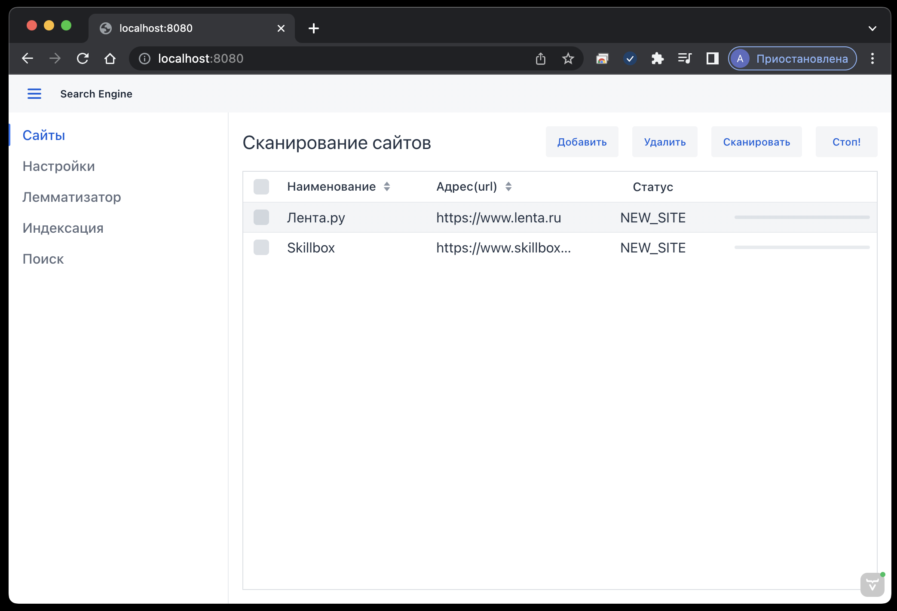

Действия, обозначенные в названиях кнопок, осуществляются только над сайтами, которые выбраны (отмечен check box слева от наименования сайта). При выполнении действия над выбранными сайтами - отметка о выделении атоматически снимается.

#### Добавить

При добавлении сайта, предлагается внести наименование и адрес:

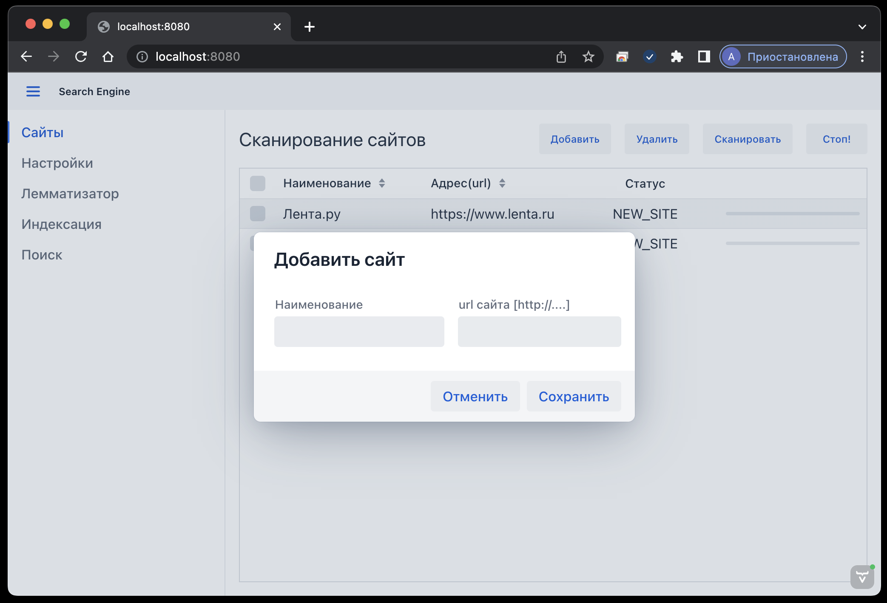

Адрес сайта обязательно должен начинаться с имени протокола: [http://] либо [https://] и не содержать слеша в конце адреса.

#### Удалить

Для удаления - необходимо отметить сайты и нажать кнопку [Удалить]. До выполнения удаления потребуется подтвердить действие. 

***Будьте внимательны:*** при подтверждении удаления из базы данных стирается вся информация о леммах и индексах, полученная при индексации удаляемых сайтов.

#### Сканировать

Перед нажатием на кнопку [Сканирвать] необходимо выбрать сайты, для которых будет осуществлён процесс скачивания и индексации страниц.  

Сканирование осуществляется с параметрами, которые установлены по умолчанию на странице [настройки].

Статус сайтов, для которых осуществлён запуск сканирования изменяется на INDEXING. При успешном завершении сканирования статус изменится на INDEXING.

#### Стоп!

Остановка процесса сканирования осуществляется только для отмеченных в check box сайтов. Статус изменяется на STOPPED. Процесс сканирования можно возобновить, отметив в check box необходимый сайт и нажав на кнопку [сканировать].

# Настройки

На странице можно измнить начальные настройки работы программы. Для пользователя доступно только редактирование значений соответствующих свойств. добавление и удаление предусмотренно для целей дальнейшей разработки и модификации приложения. Интерфейс приложения позволяет ввести только допустимые типы переменных.

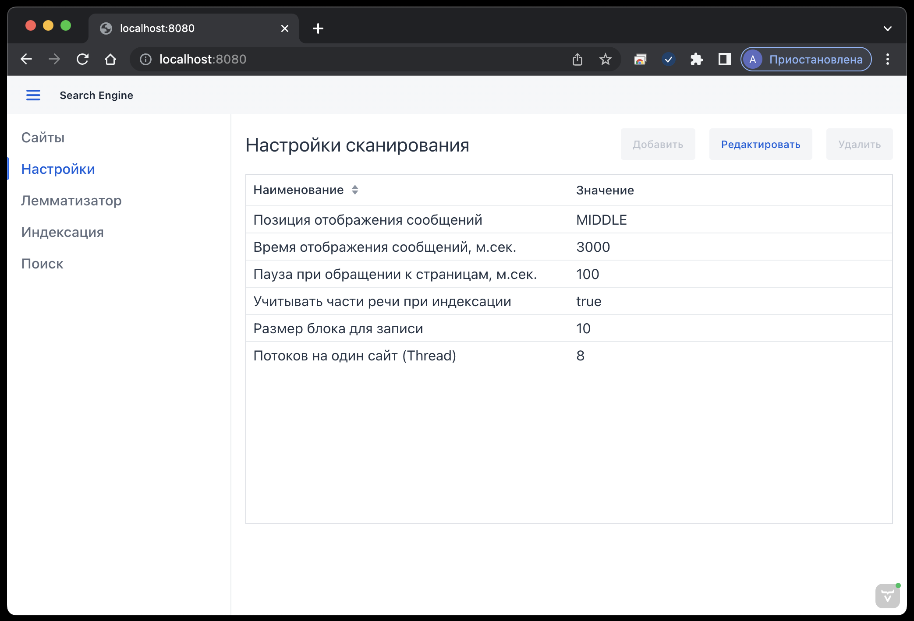

###### Позиция отображения сообщений

Определяет место на экране, в котором отображаются сообщения в процессе работы приложения.

###### Время отображения сообщений

Количество в миллисекудах

###### Пауза при обращени к страницам

Пауза между обращениями к страницам сайта в миллисекундах, для исключения блокировки.

###### Учитывать части речи при индексации 

Устанавливает необходимость исключения из индексации частей речи, установленных в разделе приложения [Индексация]

###### Размер блока для записи

Устанавливает минимальное количество загруженных страниц для записи в базу данных единым блоком.

###### Потоков на один сайт

Приложение работает в многопоточном режиме.  Свойство устанавливет количество потоков, выделяемых для каждого отдельного сайта.  

# Лемматизатор

Раздел приложения предназначен для тестировния работы лемматизатора.  В нём находятся два пдраздела: [Леммы] и [Лемматизатор]

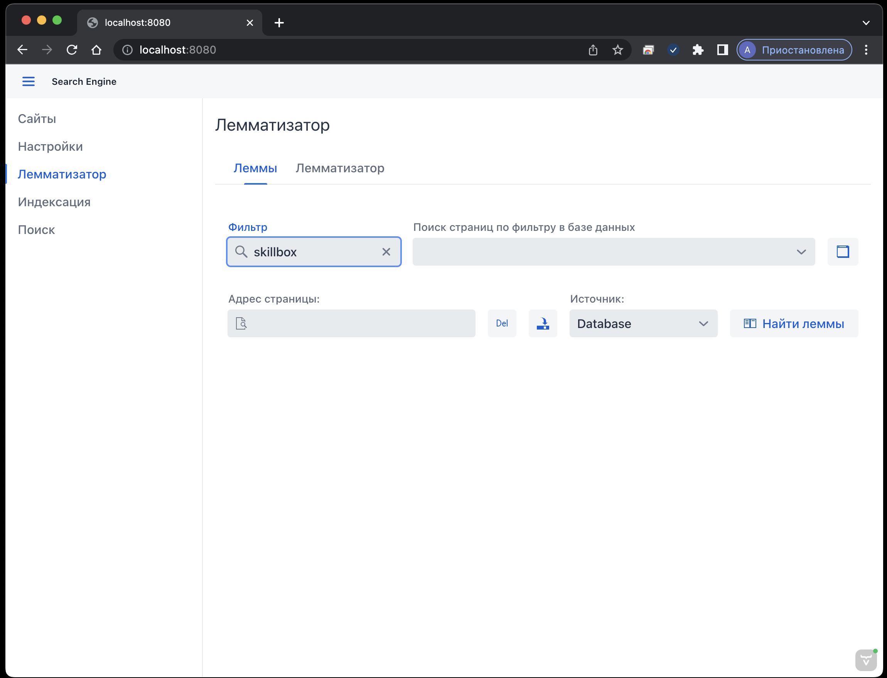

#### Леммы

##### Фильтр

Значене, введённое в поле фильтр, влияет на список страниц, выводимый в Combo Box  [Поиск страниц по фильтру в базе данных]. Этот фильтр, применяется к URL страниц в базе данных.

##### Поиск страниц по фильтру в базе данных 

Не зависит от текущего статуса индексируемых сайтов.
Позволяет выбрать из списка произвольную страницу. Без заполнения поля [фильтр] - выдаются страницы всех сайтов, информация о которых есть в базе данных на текущий момнет. Благодаря многопоточности,  независимо от того, закончена индексация по сайту или нет, отображаются страницы, которые уже прошли процесс индексации.

##### Адрес страницы

Поле может заполняться  ___вручную или автоматически___. При выборе страницы из Combo Box  [Поиск страниц по фильтру в базе данных] - адрес страницы заполняется автоматически. При необходимости можно внести адрес простым набором текста. После заполнения этого поля можно воспльзоваться функцией поиска всех лемм на указанной странице путём нажатия на кнопку [Найти леммы] в левой части окна. При этом будет выведена информация в виде таблиц, количество которых соответствует количеству CSS-выбранных селекторов в раздела [Индексация]. 

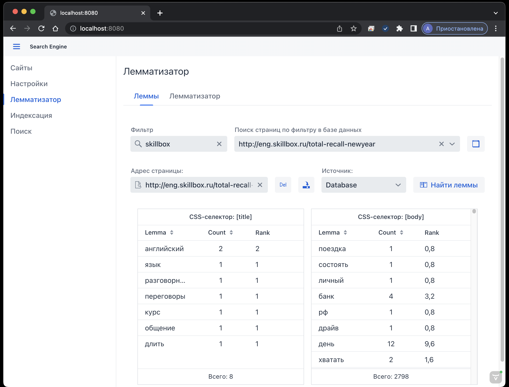

Для визуальной проверки соответствия полученных данных фактическому содержимому страницы можно воспользоваться кнопкой открытия страницы в браузере: 

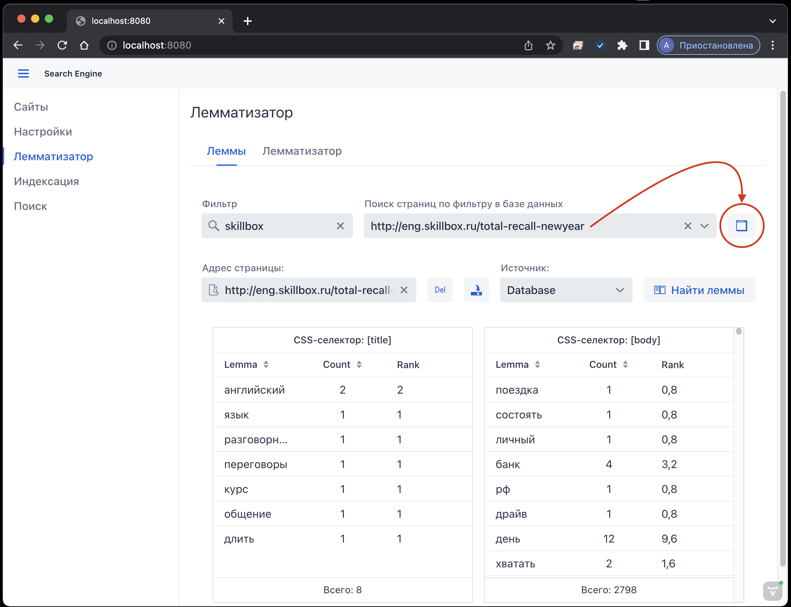

При нажатии на кнопку просмотра - откроется браузер, установленный по умолчанию для операционных систем Windows, MacOs, Linux.

##### Источник

В ниспадающем списке можно выбрать один из двух вариантов: Database (по умолчанию) или Internet. В соответстви с выбором страница будет загружена либо из локальной базы данных, либо из интернета. 

##### Кнопки удаления и переиндексации

При нажатии на кнопку удаления страница, адрес которой находится в поле [Адрес страницы] - удаляется из базы данных вместе с результатами индексации этой страницы.

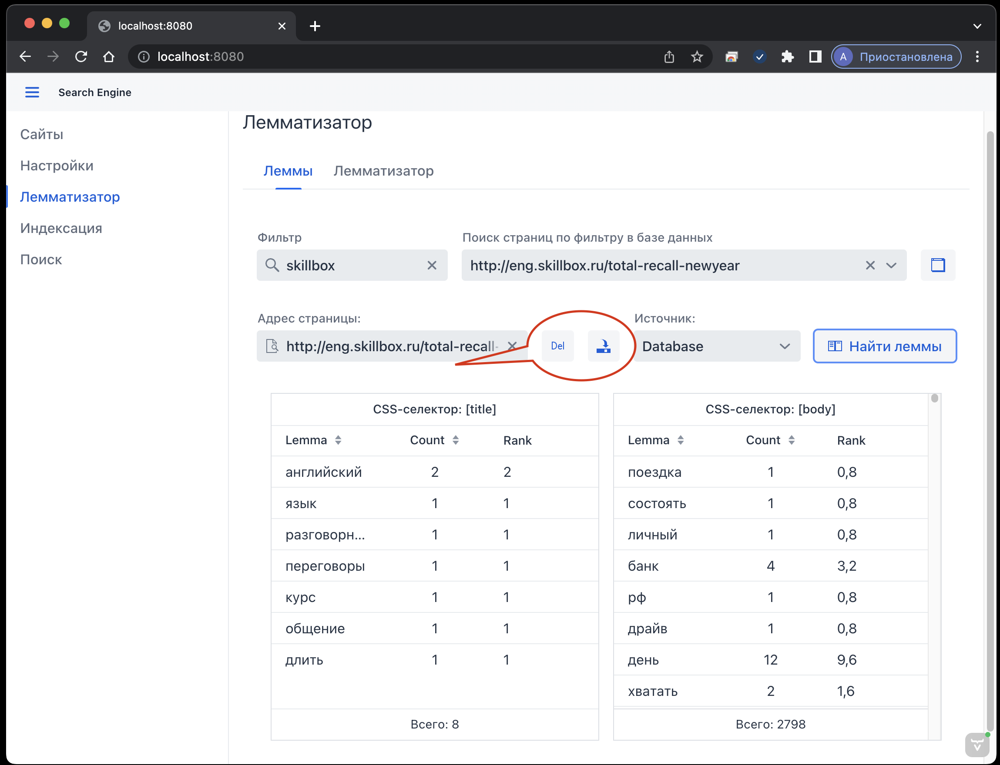

При использовании кнопки загрузки и переиндексации происходит обратный процесс - загрузка содержимого страницы из интернета, запись в базу данных и её индексация.
Проверить наличие или отсутствие страницы в базе данных можно путём использования кнопки [Найти леммы]. При отсутствии стрвницы в базе данных и выбранном [источнике] Database - приложение выдаст сообщение об отсутствии страницы. 

##### Лемматизатор

В поле [Текст] можно ввести любой текст или скопировать из буфера обмена. Кнопка [Найти 'Слова', 'Леммы' ,'Част речи']  выводит три таблицы с результатами работы лемматизатора (отображает все найденные части речи без учёта выбранных на странице приложения [Части речи]).

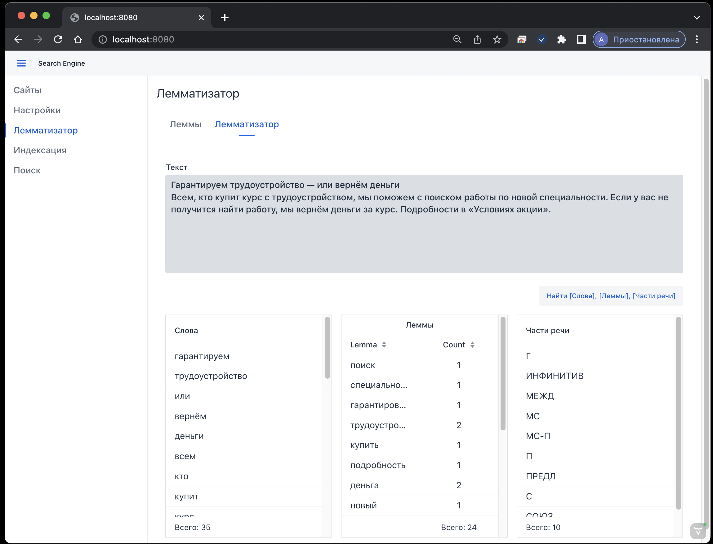

# Индексация

В разделе [индексация] три подраздела:

#### HTML-поля

Здесь можно установить необходимые для лемматизации поля со своими персональными коэффициентами веса лемм для каждого CSS-селектора. Это возможно сделать кнопками [Добавить], [Редактировать], [Удалить].  Включение или отключение CSS-селектора будет воздействовать на результаты работы лемматизатора во вкладке [Леммы] Лемматизатора. в приведенном варианте выбора, в Лемматизаторе будут отображаться две таблицы: для CSS-селектора title  и CSS-селектора body. 

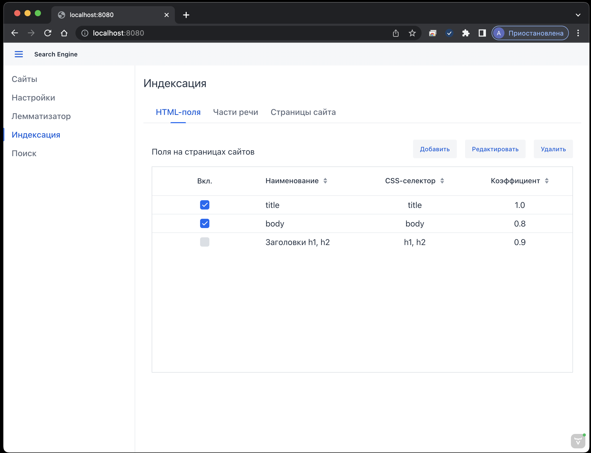

#### Части речи

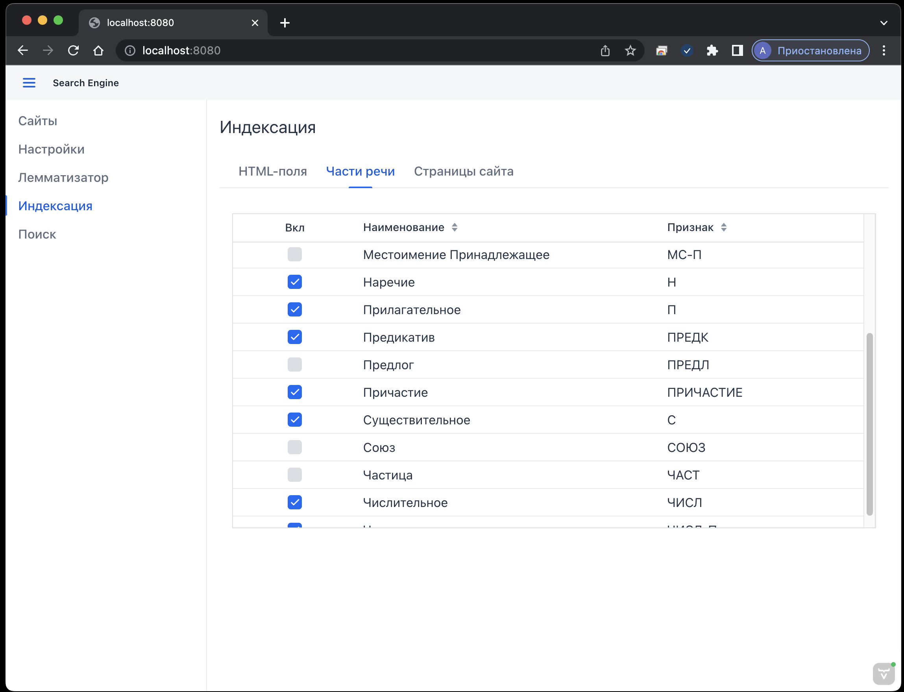

В данном разделе приложения необходимо выбрать части речи, которые будут включены в результаты индексации. Начальные установки исключают из результатов индексации предлоги, союзы, междометия, частицы и т.д.

#### Страницы сайта

Данная страница приложения позволяет проанализировать ошибки, возникающие в процессе индексации сайтов.

##### Сайт

Для анализа страниц с ошибками необходимо выбрать сайт в  поле [Сайт]. При этом в поле [Тип ошибок] автоматически выбирается значение [Все ошибки]. В результате выбора - заполняются две таблицы: 
слева таблица с индексированными страницами, справа - таблица со страницами, содержашими ошибки. 

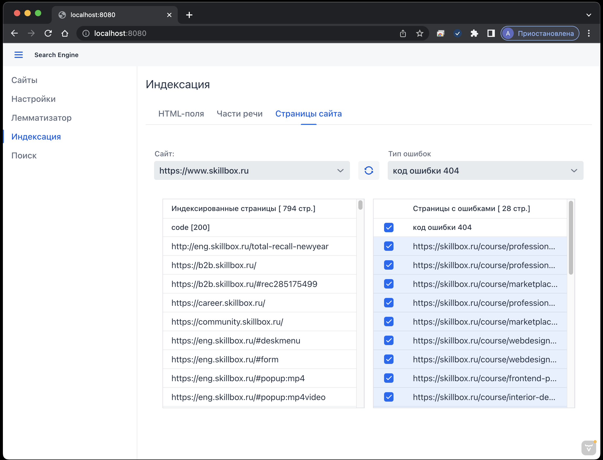

Как и все предыдущие разделы приложения, данную страницу можно использовать непосредственно во время индексации. При этом нужно понимать, что количество страниц в обеих таблицах может отличаться от текущего состояния базы данных, посколку процесс индексации, если он запущен, идёт параллельно. 

Для обновления отображаемой информации можно воспользоваться кнопкой обновления:

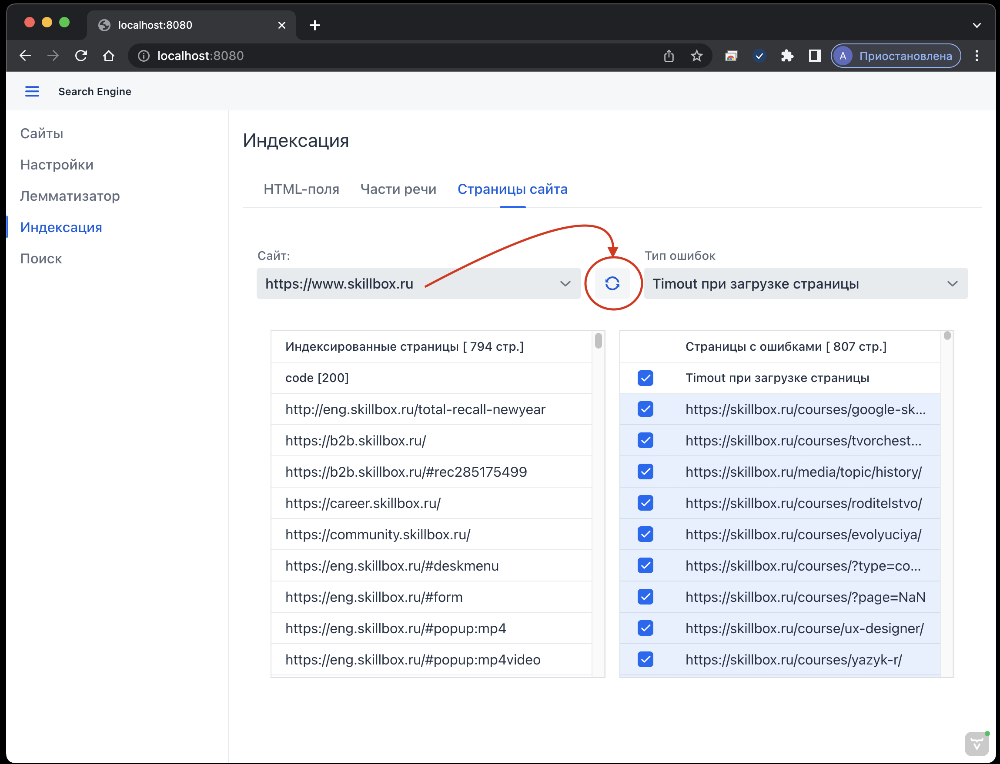

Поле тип [Тип ошибок] позволяет выбрать  страницы с тем или иным типом ошибок. В ниспадающем списке отображаются только те ошибки, которые возникли при индексации именно этого сайта.

На скришоте смоделированна ситуация с ошибкой 'Timeout при загрузке страницы'. В поле [Тип ошибок] выбран именно этот тип. 

С помощью поля Check box можно выбрать несколько или сразу все страницы с ошибками и воспользовавшись технологией Drag and Drop - перетащить выбранные страницы на сторону таблицы с индексированными страницами, тем самым инициировав процесc загрузки и индексации выбранных страниц. При этом счётчик страниц с ошибками сразу уменьшится на количество выбраных страниц и они исчезнуть из таблицы с ошибками. Однако, необходимо учитывать, что процесс загрузки и переиндексации страниц запускается отдельным потоком и загрузка происходит постепенно. Поэтому потребуется некоторое время для завершения процесса, результаты которого можно увидеть обновив информацию с помощью кнопки [обновить]. Загрузка страниц осуществляется с увеличенным значением timeout. Если в процессе переиндексации возникнут ошибки, то страницы вновь отобразятся в таблице ошибок. 
   
[Видео]

Открыть страницы в браузере из каждой таблицы можно с помощью двойного клика.

# Поиск

##### Сайт

В ниспадающем списке поля [Сайт] отображаются URL сайтов, страницы которых уже присутствуют в базе данных, даже если процесс индексации еще не завершён и идёт в параллельных потоках.

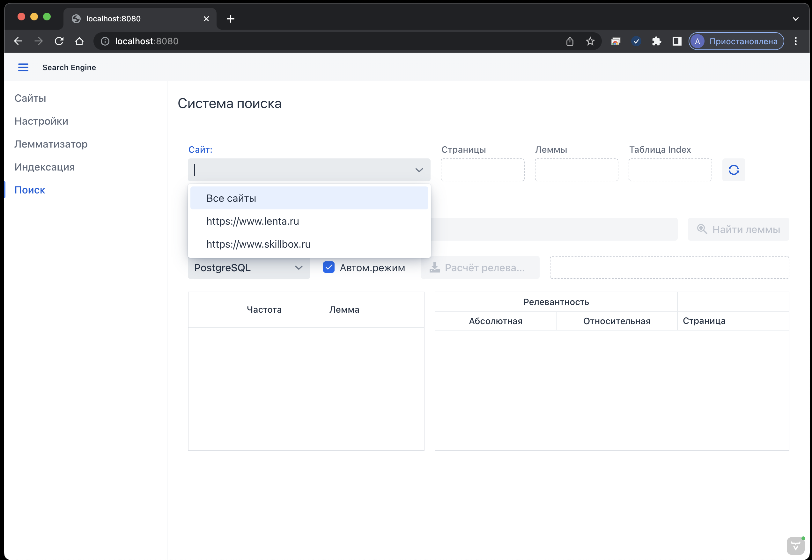

Текстовые поля справа показывают количество страниц, лемм и индексов в базе данных для одного или всех сайтов - в зависимости от выбранного пункта в Combo Box [Сайт]. Если при использовании раздела [Поиск], параллельно идёт процесс индексации, нужно учитывать, что эти значения постоянно увеличиваются. Для получения актуальной информации о состоянии базы данных можно воспользоваться кнопкой обновления информации.

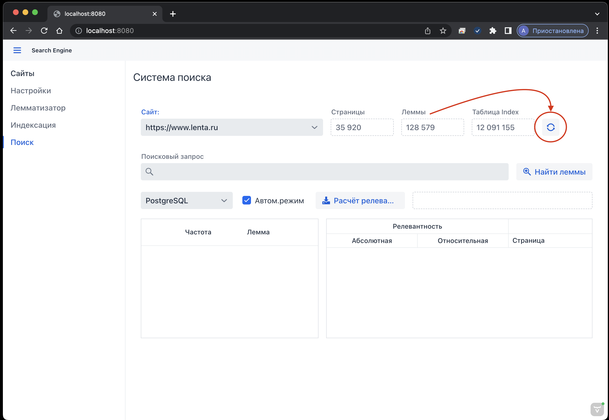

При нажатии на кнопку обновления информации запускается процедура сбора информации по всем сайтам, страницам, леммам и индексам в базе данных. Информация обновляется для всех сайтов одновременно.

##### Поисковый запрос

[Поисковый запрос] - текстовое поле для ввода поискового запроса. Поскольку лемматизатор обрабатывает только русские леммы - из запроса выбираются только русские слова. После ввода запроса необходимо нажать на кнопку [Найти леммы] слева от поля ввода запроса.

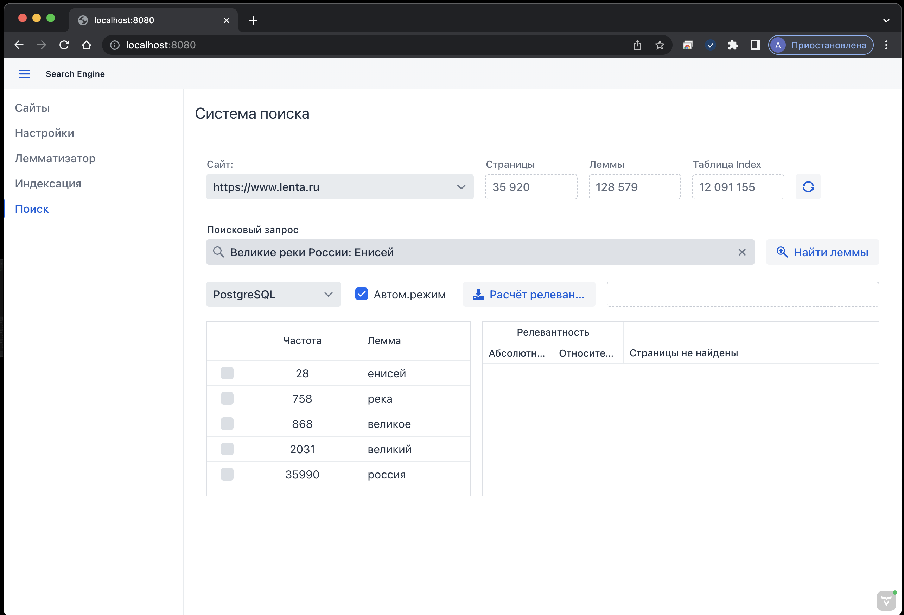

При нажатии на кнопку [Найти леммы], приложение осуществляет поиск лемм из поискового запроса в одном выбранном или во всех сайтах, в зависимости от варианта, выбранного в поле [Сайт]. В таблице, расположенной внизу слева отобразятся результаты поиска в виде лемм и частоты их встречаемости на страницах, которые проиндексированны на момент текущего поиска.

Леммы расположены в порядке возрастания частоты их встречаемости.  Для поиска конкретных страниц, на которых присутствует та или иная лемма, необходимо выбрать её с помощью Check box слева от леммы.

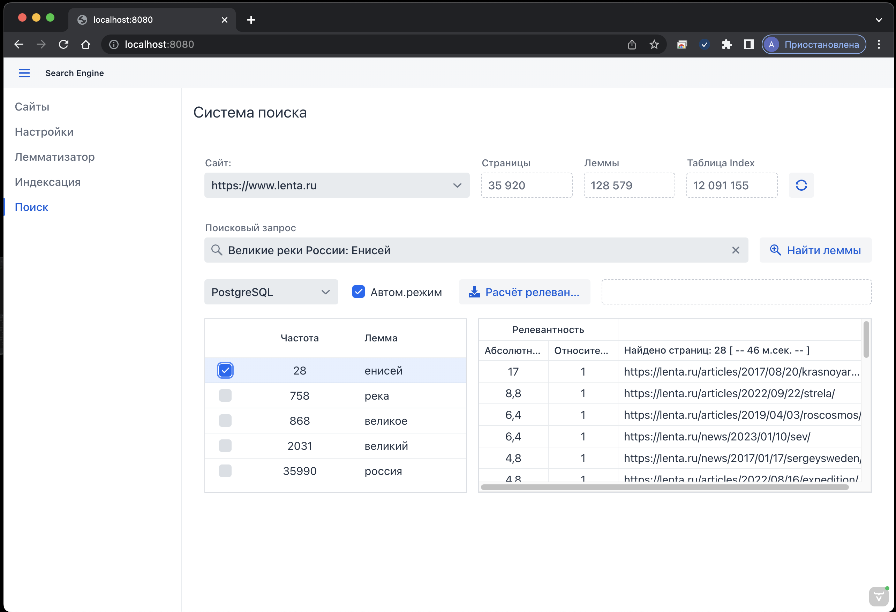

При выборе леммы - в таблице релевантности (справа внизу) отобразится информация о найденных в базе данных страницах с информацией об абсолютной и относительной релевантности страниц и URL страницы.

При выборе нескольких лемм - будет осуществлён поиск страниц, на которых присутствуют все выбранные леммы, информация в таблице результатов обновится.

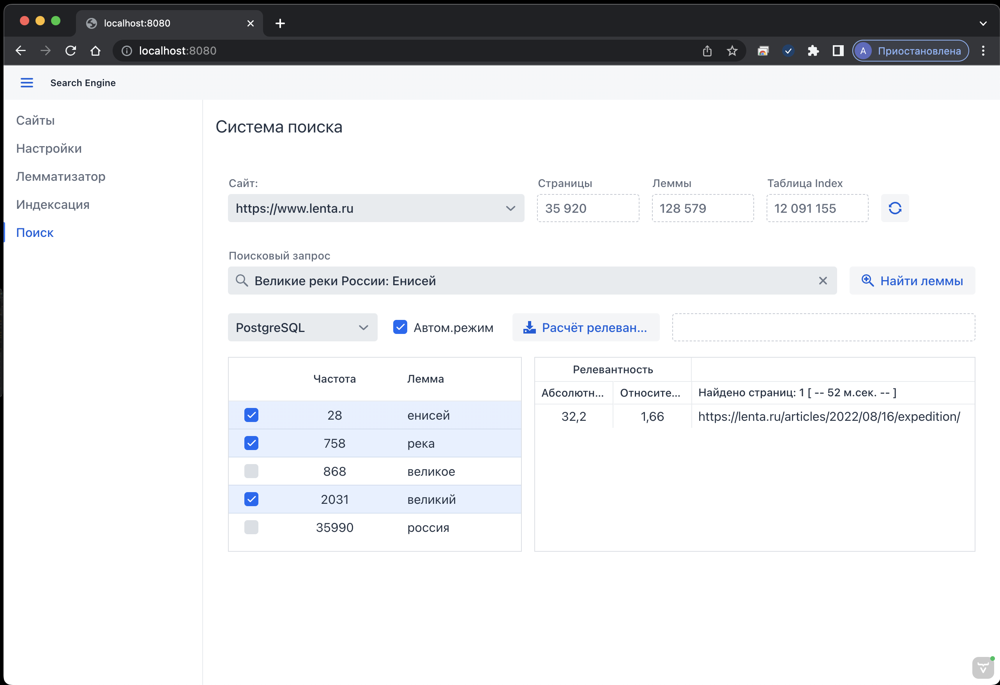

Если в таблице релевантности не отображаются страницы - значит в базе нет страниц с тем сочетанием лемм, которое вы выбрали. 

В приложении реализованы три разных алгоритма поиска страниц и расчёта релевантности. Все варианты дают дают один и тот же результат, но используют разные методы поиска и затрачивают разное время. 

Выбор желаемого метода поиска осуществляется в поле [Метод поиска].

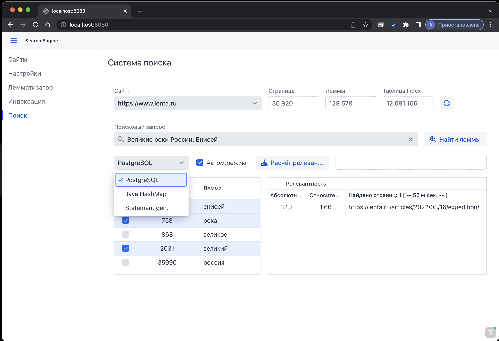

При значительном размере базы данных можно отключить режим автоматического расчёта релевантности в Check box [Автом.режим]. В отключенном режиме [Автом.режим] при выборе лемм будет отбражаться только количество найденных страниц.  Информация в результирующей таблице будет расчитываться при нажатии на кнопку [Расчёт релевантности].

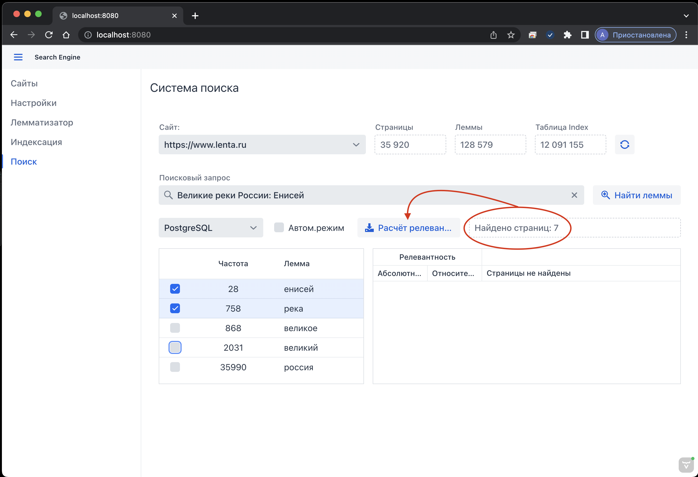

Отключение автоматического режима возможно не для всех методов поиска [Метод поиска], в связи с чем Check box и кнопка [Расчёт релевантности] доступны только для тех режимов, для которых это возможно.

Для получения детальной информации - нужно выбрать страницу в таблице релевантности. При этом, ниже таблиц отобразиться детальная информация о выбранной странице: 

- относительная релевантность
- адрес страницы
- title
- html - строки контента страницы, в которых найдены выбранные леммы. 

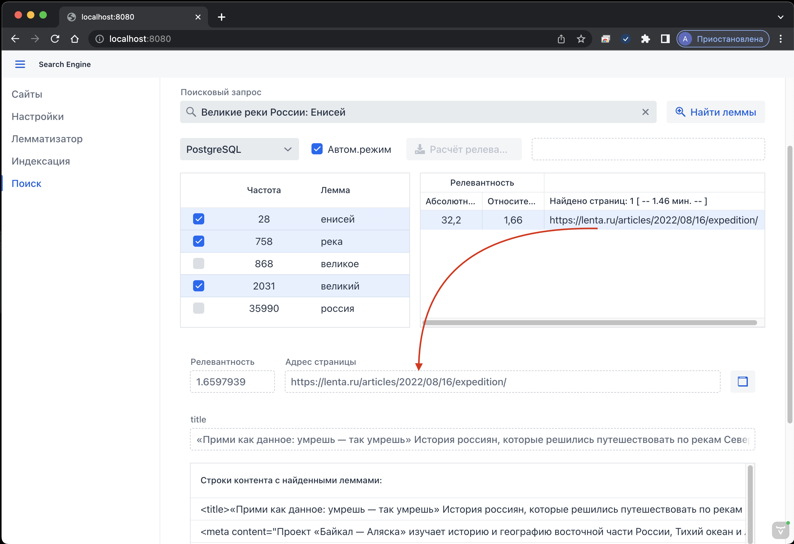

Чтобы открыть найденную страницу в браузере, нужно воспользоваться кнопкой справа от адреса страницы.

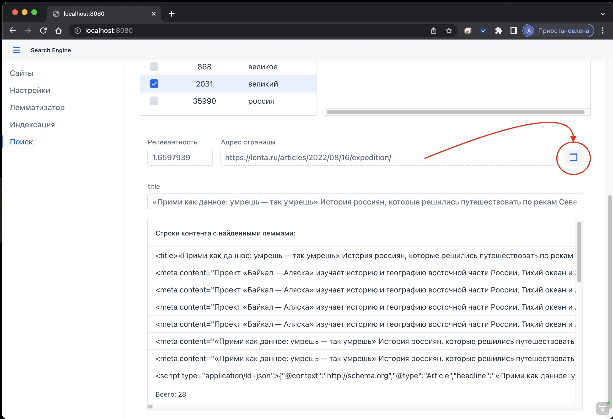

# Конфигурационный файл

Адреса сайтов вводятся в конце файла конфигурации - раздел: sites. Свойство autoScan: true - включает, автоматический запуск индексации сайтов при запуске программы. 

##### application.yaml
 
spring:  
  config:  
    activate:  
      on-profile: main  
  jpa:  
    show-sql: true  
    hibernate:  
      ddl-auto: update  
    properties:  
      hibernate:  
        dialect: org.hibernate.dialect.PostgreSQLDialect  
        jdbc:  
          batch_size: 10  
  datasource:  
    hikari:  
      data-source-properties:  
        useConfigs: maxPerformance  
        rewriteBatchedInserts: true  
    platform: postgres  
    url: jdbc:postgresql://localhost:5432/search_engine  
    username: postgres  
    password: test  
    driverClassName: org.postgresql.Driver  
logging:  
  level:  
    org:  
      hibernate:  
        SQL: debug  
        type:  
          descriptor:  
            sql:  
              BasicBinder: trace  
sites:  
  - url: https://www.lenta.ru  
    name: Лента.ру  
  - url: https://www.skillbox.ru  
    name: Skillbox  
autoScan: true  
userAgent: "Chrome/100.0.4896.127"  
referrer: "http://www.google.com"  
timeout: 1000  
delay: 100

# API
